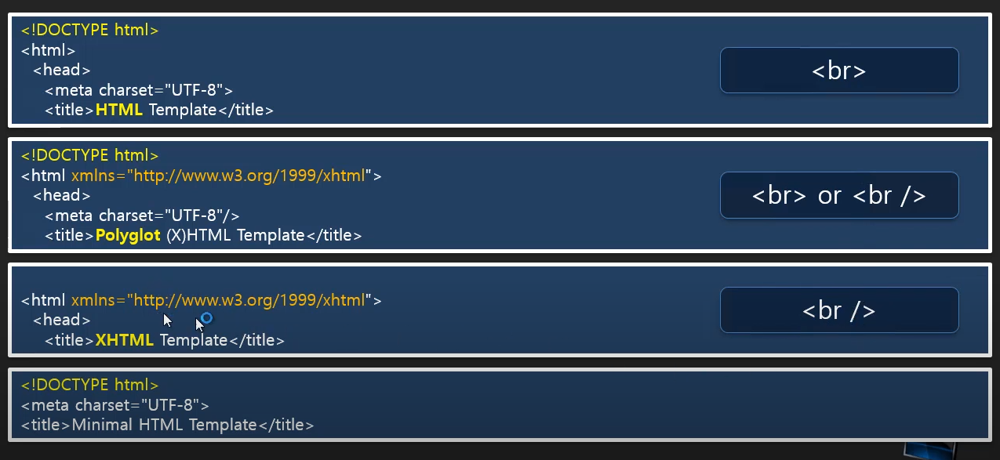

# 02. HTML의 역사


## 1. HTML 개념과 구조


### 1.1. HTML이란?

**HYML : HyperText Markup Language**


**HyperText** 

참조(하이퍼링크)를 통해 독자가 한 문서에서 다른 문서로 즉시 접근할 수 있는 텍스트이다.  ( 'hyper(건너편의, 초월, 과도한)'와 'text'를 합성 )

```html
<a href="http://www.naver.com">네이버</a>
```

* <a> : HTML의 시작이자 정체성으로 메인 tag이다.


**Markup** 

태그로 특정 범위를 감싸는 행위를 말한다.
그렇기 때문에 HTML을 마크업 언어라고 부른다.


**Language**

언어


### 1.2. HTML 기본구조와 SEO

아래의 코드는 HTML의 기본구조가 되는 태그들의 나열이다.

```html
<!DOCTYPE html>
<html>
<head>
	<title></title>
    <meta charset="utf-8"></meta>
</head>
<body>
	<h1> ~ <h6>
	<strong></strong>    
	<u></u>
	<p></p>
    <br>
	
	<ol><ul>    
		<li></li>
		<li></li>    
	</ol></ul>
	<a href = "naver.com/html" target="_blank" title="무슨 링크인지 알려줌"></a>
    <a href="https://www.w3.org/TR/html5/" target="_blank" title="html5 specification">
</body>
</html>
```

* parent, child tag : <ol><ul><li>


**SEO**

SEO란? 검색엔진 최적화, 즉 검색엔진에서 찾기 쉽도록 사이트를 개선하는 프로세스를 말한다.

* 검색 엔진은 tag를 근거를 해서 정리한다.
* 즉, <h1> ~ <h6> tag를 사용한 제목이 있어야 검색엔진이 제목을 빠르게 인지하고, 상위노출을 시킬 수 있다.
* 상황에 맞는 적절한 tag 사용을 해야 하는 이유이다.


**[ 참고 ]** **web tag ranking**

https://advancedwebranking.com/html/

* 전 세계에 있는 웹페이지들이 몇 종류의 태그로 이루어져 있는지를 보여주고 있습니다.


**[ 참고 ] DOM**

DOM (문서 객체 모델)이란? 

문서 객체 모델, 즉 DOM은 웹 페이지(HTML이나 XML 문서)의 콘텐츠 및 구조, 그리고 스타일 요소를 구조화 시켜 표현하여 프로그래밍 언어가 해당 문서에 접근하여 읽고 조작할 수 있도록 API를 제공하는 일종의 인터페이스입니다.

즉, 자바스크립트 같은 스크립팅 언어가 쉽게 웹 페이지에 접근하여 조작할 수 있게끔 연결시켜주는 역할을 담당합니다.
( HTML을 트리구조의 계층적인 구조로 표현한다. )


### 1.3. 웹 표준 기구 (W3C) / DOCTYPE

다양한 브라우저의 존재와 렌더링 방식으로 인해 호환성 문제가 발생한다.
다양한 브라우저의 경쟁 구도로 인한 독자적인 태그들까지도 탄생한다. 

이런 문제를 해결하고자 '웹 표준기구 W3C' 탄생하고,
표준 권고안을 만들게 된다.

HTML 4버전 시기에는 각 DOCTYPE을 대표하는 3가지 권고안 중 1가지 방식을 표기해 사용했다.
HTML 5버전 부터는 표준화를 완료하여 아래 방식(1가지)으로 표기하고 있다.

```html
<!DOCTYPE html>
```


* DOCTYPE : 문서의 유형을 정의하기 위해 사용하는 선언문(DTD / Document Type Definition)이다. 

  * DOCTYPE은 웹 브라우저에서 처리할 문서가 HTML이며 어떠한 버전으로 사용하였으니 해당 방식대로 해석하라는 의미를 갖는다.
  * [주의!] 웹 문서의 시작을 알리며 `<html>` 태그보다 먼저 선언한다. 


## 2. HTML의 역사

### 2.1.  SGML과 HTML 관계? 

---

**발전 순서 : GML => SGML => HTML**

---

**GML ( General Markup Language )**

IBM에서 범용적으로 사용할 수 있는 마크업 언어를 만들 었다.
( 데이터 관리를 고민한 흔적이 남아있다. )


**SGML ( Standard Generalized Markup Language ) - Meta Language**

마크업 언어를 정의하는데 사용되는 언어로 Meta Language라 부른다. 
( IBM에서 1960년대에 개발한 GML(Generalized Markup Language)의 후속이며, ISO 표준이다. )


**HTML ( HyperText MarkupLanguage ) - Markup Language**

SGML이라는 Metat Language를 응용하여 만들게 되었다.


### 2.2. XML과 XHTML 관계

**XML ( Extensible Markup Language ) - Meta Language**

W3C에서 개발된, 다른 특수한 목적을 갖는 마크업 언어를 만드는 데 사용 하도록 권장하는 다목적 마크업 언어다. 
( SGML의 단순화 된 부분집합 )

* XML은 다른 많은 종류의 데이터를 기술하는 데 사용할 수 있다. 
* XML은 주로 다른 종류의 시스템, 특히 인터넷에 연결된 시스템끼리 데이터를 쉽게 주고 받을 수 있게 하여 HTML의 한계를 극복할 목적으로 만들어졌다.


**XHTML ( Extensible Hypertext Markup Language ) - Markup Language**

XHTML은 EXtensible HTML을 의미합니다.

* XHTML은 HTML과 거의 비슷하지만, 문법의 적용이 조금 더 엄격한 특징을 가지고 있습니다.
* 타입을 정하는 대로만 쓰게 했다면, 형식(열기 닫기 단일태그)만 맞으면 된다.
* 열고 닫는 태그 규칙만 잘 맞춰 주면 이름을 부여하며 확장 하는 것을 허용한다.


선언문 : `<html xmlns="http://www.w3.org/1999/xhtml">`

* 틀림(X) : `<br>` 
* 옳음(O) : `<br />` 
* 틀림(X) : `<p>`첫 번째 문장`<p>`두 번째 문장 
* 옳음(O) : `<p>`첫 번째 문장`</p>` `<p>`두 번째 문장`</p>`


**[ HTML / XHTML ]**

* HTML - SGML : HTML이 SGML의 응용이다. ( 매우 유연한 마크업 언어이다. )
* XHTML - XML : XHTML은 SGML의 제한된 부분집합인 XML의 응용이다. 


**[   >   VS   />  ]**




### 2.3. HTML의 버전과 HTML5의 탄생배경

---

**[ 탄생 순서 ]**

HTML 1.0 => ... => HTML 4.0 => XHTML 1.x ( 다른 버전 / 빠지는 버전 or 같이 쓰는 버전 ) => HTML 5.0 ... HTML 5.2

---

2000년대 W3C는 HTML을 더이상 발전 시키지 않고, XML 기반의 XHTML을 발전시켜 나가겠다고 결정을 내린다. 

호환성을 고려해 기술 발전시켰지만 XHTML 2.0 출시부터 호환성 문제가 대두되며 브라우저들이 반기를 들기 시작한다.
( 이 당시 브라우저는 플래시, 실버라이트 등이 등장한다. )

결국 브라우저들은 W3C는 버렸던 HTML4를 이어 나가 HTML5를 만들게 된다.


MS를 제외한 대부분의 벤더들이 WHATWG를 만들게 된다.
( HTML / HTML 기반 멀티미디어 3D / API 기술 등 연구하게 된다. )

당시 웹은 단순한 문서가 아니었다.

그래픽 멀티미디어, 네트워크, 로컬 저장소, 3D 가속 기술을 수반하기 위해서 다양한 API(Rich API)들을 플러그인 형식으로 웹문서에 꽂아 사용한다. 그래서 이것을 수반할 수 있는 다양한 기술들(Rich API를 위한 브라우저 플러그인)이 등장하게 되었는데 대표적으로 Adobe Flash/Flex, Microsoft Silverlight가 있다.

하지만 이런 적용 방식에도 문제점과 불편함이 발생하게 되었고, 이후 웹문서에 직접 구현해서 사용할 수 있는 HTML 5가 나오게 된다. 기존에 있던 HTML 4에 멀티미디어 기술 등을 포함하게 된 것이다.

이런 이유로 처음에는 시맨틱 웹을 추가하던 W3C와 WHATWG가 척을 지내다가 나중에는 화해를 하고 함께 HTML5 기술을 개발하게 된다.

> WHATWG
>
> W3C가 의사결정이 느리다는 이유로 애플, 모질라 재단, 오페라 소프트웨어가 모여서 2004년에 만든 그룹이다.
>
>  이후 2011년까지 W3C와 WHATWG는 같은 편집자(이안 힉슨)가 운영하며 협력하는 관계였다. 2012년에 서로 목표가 다르다는 점을 밝히면서 편집팀을 분리했다. 주요 브라우저 벤더들로 구성된 WHATWG는 새로운 기능을 구현하는 데 더 관심이 있었던 것이다. 이후 2019년까지는 각자 표준을 발표했다.
>
> 그리고 2019년에 결국 WHATWG가 이겼다. 
> W3C와 WHATWG이 양해각서를 체결하고, WHATWG의 Living Standard를 HTML과 DOM 명세 표준으로 삼기로 했다. 
> 그래서 현재 w3.org/TR/html5에 접속하면 WHATWG의 Living Standard(https://html.spec.whatwg.org/) 페이지로 이동한다.
>
> [참고] https://en.wikipedia.org/wiki/WHATWG

---

1. W3C : 시맨틱을 지원하는 문서로의 변화 
   ( 문서를 좀더 문서답게 미래지향적으로 만들기 집중 )
2. WHATWG : 프로그래밍 플랫폼으로의 변화 
   ( 프로그래밍 환경으로 변화 집중 )
   Web Hypertext Application Technology Working Group

* 기존 웹의 구조 : 일반 사용자가 HTML을 보면서 디자인까지 활용하며 충분히 인지한다.
* 시맨틱 웹의 구조 : 에이전트(모바일, TV 등)이 웹 문서 데이터를 보면서 인지 할 수 있다.


**참고자료**

[[웹표준 기반의 웹 퍼블리싱 HTML5, CSS3 강좌](https://www.youtube.com/watch?v=MLqn_-GDu_E&list=PLq8wAnVUcTFUffyIZTTV0LZr1RrfQEuHX&pp=iAQB)]- 뉴렉처

[[WEB1 - HTML & Internet](https://opentutorials.org/course/3084)] - 생활코딩

[[WEB2 - CSS](https://opentutorials.org/course/3086)] - 생활코딩

[[HTML,CSS 개발을 위한 핵심 가이드](https://www.inflearn.com/course/html-css-강좌-codesquad#curriculum)] - 코드스쿼드

[[코코아톡 클론 코딩](https://nomadcoders.co/kokoa-clone)] - 노마드코더

