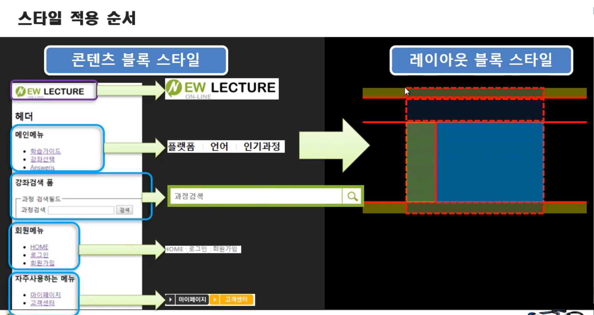
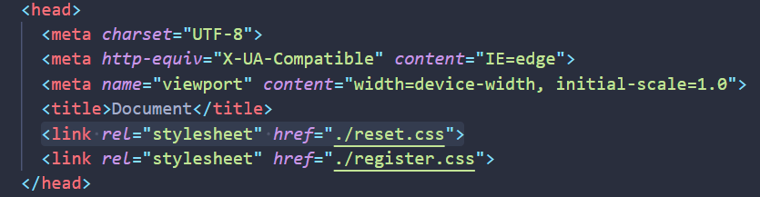

# 05. CSS 개념과 역사

## 1. CSS 의미와 브라우저

### 1.1. CSS 의미

Cascading Style Sheets


**Cascading** 

* 계단식으로 폭포가 떨어지는 중이라는 의미이다. ( 폭포처럼 흘러 내리는 모습을 떠올리면 된다. )  

* 스타일 시트는 위에서 아래로 내려오면서 이미지 마지막에 덮게 된다.


### 1.2. 브라우저

* **user agent stylesheet** 
  * 브라우저가 기본적으로 주는 style 속성이다.
    ( 브라우저는 요소들에게 많은 style 속성을 부여하고 있다. )
  
  * 브라우저마다 적용되는 style 속성이나 방식이 다르다.
  
* 브라우저가 CSS 코드를 읽을 때 cascading 방식으로, 즉 위에 있는 코드부터 차례 차례로 읽는다.

* 개발자 도구를 사용해서 content의 위치를 찾고 임의로 값을 넣어보며 확인 할 수 있다.

* [핵심] CSS라는 것은 결국 브라우저가 각자 화면에 보여 주던 방식 위에 새로이 스타일을 덧씌우는 것이다.


## 2. CSS 역사 ( 탄생 배경 )

### 2.1. CSS 이전

과거 html은 디자인을 대신 할 언어를 만드는 대신 `<font>` 태그를 사용했지만 그 의미와 효율성에 한계를 느끼고 css라는 언어를 만들게 된다. 
( css 탄생 이전까지는 한 번에 처리가 불가능한 구조로 비효율적인 작업을 했다. )


### 2.2. CSS 탄생 이유

HTML에 정보에 집중하기 위해서 HTML에 있던 디자인 기능을 CSS라는 개념으로 분리 시키게 된다.

이로써 디자인 기능을 더욱 강화 시키고, 유지 보수를 편리하게 만들었다.


**[ CSS 이점 ]**

1. 유지 보수 & 협업 향상
      - 디자이너, 프런트엔드 등
2. 디자인 집중화
   * 디자인을 위한 도구와 기술을 통한 확장성
   * 논리적인 과정을 거쳐 만들어지는 것을 배워야 더 확장된 디자인을 만들 수 있다. 
3. 자원 효율 ( 트래픽 절약 )


## 3. CSS 적용 방식

### 3.1. CSS 기본 형태와 상속

#### 1) CSS 기본 형태

CSS가 하는 일은 HTML 태그를 가리키는 것이다. 
가리키는 것 자체를 selector라고 한다.

* selector (선택자)
* **Declaration (선언)**
  * property (속성)
  * value (값)


**작성 순서**

1. selector을 작성한다. 

2. property에 value를 부여한다. ( 이를 Declaration 이라고 한다. )

3. selector은 다수 property를 가질 수 있어 중괄호{ }(curly bracker)를 사용해 묶는다.


[주의!] 

1) 세미콜론(;)으로 닫아줘야 한다. 
     * 예시 : (속성)이름: 값; 
2) 속성 이름은 띄어쓰기를 쓰지 않는다.
     * 예시 : font-size(o) / font size(x) 
3) 속성 이름은 오직 ' - '만 사용할 수 있다.
     * 밑줄(_)이나 슬래쉬(/)는 사용하면 안 된다.
4) 속성 값은 어떤 값이든 쓸 수는 있지만 맞는 값을 써줘야 효과가 적용이 된다. 
     ( 뒤에 붙는 단위 px 등도 맞아야 한다. )

> ---
>
> ```css
> span { 
> 	color : red; 
> }
> ```
>
> span - selector
>
> color - property
>
> red - value
>
> ---


#### 2) CSS 상속

* CSS도 상속이 된다.
  자식 태그들에 스타일이 반영된다.
* [주의!] 배치 관련 상속 - 예외
  Box Model, border, padding과 같은 배치와 관련된 값들은 상속되지 않는다.


### 3.2. 스타일 적용 방식  ( 3가지 )

1. **inline 방식**

   **html** 내에서 **style property**를 활용하는 방식이다.

   ```html
   <span style="color:red";></span>
   ```

   별도의 CSS보다 먼저 적용된다.


2. **internal 방식** 

   **html** 내에서 **style tag**를 활용하는 방식이다.

   * [장점] 별도로 CSS 파일을 관리하거나 요청할 필요가 없다.
   * [단점] 구조와 스타일이 섞여 있다보니 유지보수가 어렵고, 관리하기 어려운 측면이 있다.

   ```css
   <style>
   	a {
   		color:red;
   		text-decoration:none;     <!--장식을 없앤다.(밑줄이 없어진다.)-->
   	}
   	h1{
               font-size:45px;
               text-align:center;
           }
   </style>
   ```

   | Selector        | 선택자 ( a{} )                |
   | --------------- | ----------------------------- |
   | **Declaration** | **선언, 효과 ( color:red; )** |
   | **Property**    | **속성 ( color )**            |
   | **Value**       | **값 ( red )**                |

   

3. **external 방식 ★★★**

   * 일반적으로 많이 사용하는 방식이다. ( 전문적, 실전 )
   * 유지보수 관리에 좋다.
     * (주의!) head 안에 CSS 파일이 연결 되어 있어야 한다.

   * **CSS file로 관리하는 방식**
     
     * CSS 파일을 따로 생성하여 link 태그를 통해 html에 연결 시켜준다.
     
     ```html
     <link rel="stylesheet" href="style.css" />
     ```

---

> [ **우선순위** ]
>
> inline > internal > external 의 우선순위 순서로 적용

---

> **[ 스타일 적용 순서 ???? - 검증필요 ]**
>
> 1. 콘텐츠 블록 스타일
>
> 2. 레이아웃 블록 스타일
>
>    
>
>    [참고] 05-2. 스타일 적용 순서.png

---


### 3.3. 스타일 리셋, 평준화, 현대화

|  reset.css  |  normalize.css  |

HTML 태그가 브라우저마다 차이가 있으며, 특정 스타일이 들어가 있다.

* reset.css
  * HTML이 가지고 있는 태그의 모든 스타일을 초기화 시키는 방식이다.
  * 기본적으로 브라우저에서 제공하는 body의 margin을 없애는 것 목적이다.
* normalize.css
  * HTML이 가지고 있는 태그의 스타일을 모든 브라우저 똑같게 평준화 시키는 방식이다. 
  * reset과는 달리 스타일을 모두 초기화를 시키지는 않는다.


---

* **Modernizr** : 프론트 개발자들이 현재 브라우저의 상황을 체크하고 싶을 때 사용하는 툴 이다.
  
  * 구 버전의 브라우저의 경우 HTML5가 적용되지 않는 브라우저가 있을 수 있기 때문에 선택자가 작동 안되는 경우도 있다.
  
  * 브라우저가 지원하지 않는 태그라고 해도 javascript 등을 통해 태그를 생성하는 방식이 있다.
    
    * (ex) document.createElement("article")
    
    * HTML5Shiv : HTML 5에 등장하는 태그들을 생성하는 코드를 나열한 것이다. 
    
      기존 Internet Explorer에서 HTML5 섹션 요소를 사용할 수 있게하며 Internet Explorer 6-9, Safari 4.x (및 iPhone 3.x) 및 Firefox 3.x에 대한 기본 HTML5 스타일을 제공한다. 
    
      ( ie 하위 버젼 브라우저에 html5 엘리먼트를 인식가능하게끔 해주는 스크립트 )
    
    * Check Enabled : 기능을 제공하는 태그들도 있어 구 브라우저에 작동할 수 있는지를 확인해야 한다.


**[ reset.css 적용 방식 (최적화) - 2가지 ]**

reset.css를 사용하는 방식에는 2가지가 있다.

* reset.css 따로 제작하거나 구글링을 통해 다운 복사 붙여넣기를 해서 사용할 수도 있다.

1. **@import** : 기존 main이 되는 style.css에 @import 하는 방식

   * html 문서에 link 태그 이용해서 추가하지 않아도 된다.

   * 사용법이 깔끔하다. 

   * 유지보수와 가독성에 좋지만 속도가 느려질 수 있다.
     
     * css 파일을 타고 가는 방식이기 때문에 문서가 커질 경우 요청 속도가 느려질 수 있다.
     * 속도가 느려지는 문제가 발생한다면 link href를 통해 추가해서 사용하자.
     
     ```css
     @import "reset.css";
     ```

2. **link href** : index.html에 따로 link를 추가해서 사용하는 방식 ★




