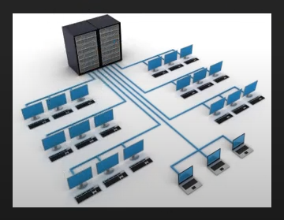

## 01. 웹 역사와 브라우저

### 1. 웹이란 무엇인가?

'웹'은 '월드 와이드 웹'의 줄인 말이다.

월드 와이드 웹(World Wide Web)이란 **인터넷에 연결된 사용자들이 서로의 정보를 공유할 수 있는 세계적인 정보 공간**을 의미합니다. ( 기본적으로 웹 문서를 전달받고 문서를 요청할 수 있다. )

간단히 줄여서 WWW나 W3라고도 부르며, 간단히 웹(Web)이라고 부른다.
( 웹이라 가장 많이 불린다. )

* 웹 기술 자체는 공짜다.
  * WEB : PUBLIC DOMAIN 
  * 퍼블릭 도메인이란? 저작권이 소멸되었거나 저작자가 저작권을 포기한 저작물을 말한다.

* 웹 문서와 웹 퍼블리싱
  * '웹 페이지 ( 웹 문서 )'가 모이면 '웹 사이트' 라고 합니다.
    ( 이런 웹 문서를 만드는 것을 '웹 퍼블리싱'라고 한다. )
  * 웹 퍼블리싱 : 웹 문서 만들기 ( 출판하기 )

### 2. 웹의 역사와 인터넷의 차이

웹과 인터넷은 같지 않다.

<u>인터넷이란?</u> TCP/IP라는 통신 프로토콜을 컴퓨터를 연결하여 정보를 주고받는 컴퓨터 네트워크이자, 네트워크와 장치 사이의 통신을 목적으로 상호 연결된 '글로벌 컴퓨터 네트워크 시스템'을 말한다. (위키백과)

1. **초창기 네트워크**
     메인 프레임을 중심으로 연결된 네트워크 형태의 시스템이다.

2. **인터 네트워크 => 인터넷**
     ( inter network  =>  internet ) 
     
     * 전세계에는 이런 메인 프레임을 중심으로 한 수 많은 네트워크가 있었고, 이것을 서로 연결하게 된다. 
         그리고 훗날 인터넷이라고 부르게 된다. 
     
       * 1960년 - 핵전쟁에 대비한 군사적인 목적에 의해 탄생하게 되었다.
     

---

**인트라넷 (intranet)**  

인트라넷은 인터넷 기술을 이용하여 내부업무를 통합하는 정보시스템을 말합니다. 즉, 인트라넷은 별도의 통신망이 아닌 인터넷을 이용하여 **조직 내부시스템을 구축하는 것**을 말합니다.  

인터넷과 인트라넷의 공통점은 같은 통신망을 이용한다는 점이고, 인터넷과 인트라넷의 차이점은 그 사용대상이 일반 모두가 사용하느냐와 특정 대상만 사용하느냐의 차이점이 있습니다. 

 (ex) 군 전산망을 대표적인 예로 들 수 있다.

---

#### 2.1. 인터넷 환경의 발전

인터넷 환경의 발전을 보면 **웹과 인터넷을 혼동하게 된 이유**를 알 수 있다.

**[ 초기 인터넷 환경 ]**

클라이언트 <===> 서버

서버와 클라이언트를 오가는 많은 정보통신 기술들이 사용된다.

 * 파일을 전달하기 위한 규약 : FTP ★
 * 네트워크를 통해 전자우편(이메일)을 전송하는 기술 표준 : SMTP
 * 인터넷이나 로컬 영역 네트워크 연결에 쓰이는 네트워크 프로토콜 : TELNET
 * 웹 문서를 전달 할 수 있는 규약 : WWW(http) ★
    ( 관련 프로그램 : 크롬, 인터넷익스플로러, 오페라 등 )

**[ 현대 인터넷 환경 ]**
현대에 들어 인터넷과 웹 둘의 차이가 없게 느껴 진 이유는 인터넷 위에 웹이 있고, 그 위에 파일 메일 등 거의 모든 일을 처리할 수 있게 되어서 이다.

#### 2.2. 웹의 탄생과 대중화

1. **팀 버니스리 - 기술 탄생**
    * 1990년 11월 12일 Hypertext project 제안
    * 효율적인 문서 공유와 관리를 위해 탄생하게 된다.
    * 유럽입자물리 연구소에서 탄생했다. 
    * 최초의 웹 페이지, 웹 브라우저 등도 함께 탄생한다.
      * 웹의 메소포타미아 : http://info.cern.ch/

2. **마크 앤던슨 - 대중화 ( 웹 브라우저 )**
    * 1993년 Mosaic(later Netscape)
    * 윈도우 환경에서 하이프링크를 표현할 수 있게 된다.
    * 웹 브라우저를 사용하게 된 것이다.

#### 2.3. 웹 브라우저

브라우저는 HTML 파일에 에러가 있다고 말해주지 않는다.
브라우저는 언제나 컨텐츠를 보여준다. 

[장점] 사용자는 에러가 있어도 사이트 이용이 가능하다.
[단점] 개발자 입장에서는 개발과 유지보수에 어려움을 겪는다.

### 3. 웹문서와 웹서버의 이해

Web Browser ( client ) / Web Server ( server ) 

2대의 컴퓨터는 인터넷으로 연결되어 있다.

clint pc가 server pc에 정보를 요청(request)하면
server pc는 응답(response)하여 client pc에 index.html 파일을 넘기게 된다.

**웹 서버** (서버)

- 문서를 가지고 있으면서 제공하는 쪽이다. 
- 서버의 하드디스크에는 수 많은 웹 문서 (index.html - 포함), 디렉토리, 홈 디렉터리가 있다. 
- (ex) 홈 디렉토리/wiki/ 
- (ex) en. wikipedia.org 

**웹 클라이언트** (브라우저)

* 특정 방식(HTTP 방식 등)으로 GET 요청(REQUEST)을 하면  웹 서버는 관련 방식을 통해 홈 디렉터리를 시작으로 문서를 찾아서 응답(RESPONSE)을 하게 된다.
* (ex) http://en.wikipedia.org/wiki/CERN 

**[ 웹 호스트와 호스팅 ]**

* 호스트 : 인터넷에 연결된 컴퓨터 하나 하나를 말한다.

* 호스팅 : 이런 컴퓨터를 빌려주는 사업
  * 웹서버를 전문적으로 빌려주는 비즈니스를 **웹호스팅 업체**라고 부릅니다.

**[ 웹 사이트를 보는 시각 ]**

웹 문서 vs 웹 애플리케이션

- 최근은 웹 애플리케이션으로 주로 보고 있다.

### ■ 웹 언어 : HTML / CSS / JavaScript 

* HTML : content와 structure를 생성한다. - 1990년
  * 일반인 외에도 검색 엔진과 장애인 분들의 사용이 고려하여 작성된다.
* CSS : content를 디자인에 맞게 조정한다. - 1996년 

  * HTML과 CSS는 함께 쓰여야 한다.
  ( HTML만으로도 사이트를 만들 수 있지만 '심미성'과 '사용성'에 매우 좋지 않다. )
* JavaScript : content의 동적 행위를 부여한다. - 1995년
  * 유일한 프로그래밍 언어이다.
  * 과거 : 웹의 동작
    현대 : 웹의 모든 것 ( 컨텐츠, 디자인, 동작 ) - 모든 걸 다하게 되었다.

**[요약]** 

HTML - 뼈대와 내용

CSS - 근육(피부)과 스타일

JavaScript - 두뇌

**참고자료**

[웹표준 기반의 웹 퍼블리싱 HTML5, CSS3 강좌](https://www.youtube.com/watch?v=MLqn_-GDu_E&list=PLq8wAnVUcTFUffyIZTTV0LZr1RrfQEuHX&pp=iAQB) - 뉴렉처

[WEB1 - HTML & Internet](https://opentutorials.org/course/3084) - 생활코딩

[WEB2 - CSS](https://opentutorials.org/course/3086) - 생활코딩

[HTML,CSS 개발을 위한 핵심 가이드](https://www.inflearn.com/course/html-css-%EA%B0%95%EC%A2%8C-codesquad#curriculum) - 코드스쿼드

[코코아톡 클론 코딩](https://nomadcoders.co/kokoa-clone) - 노마드코더
