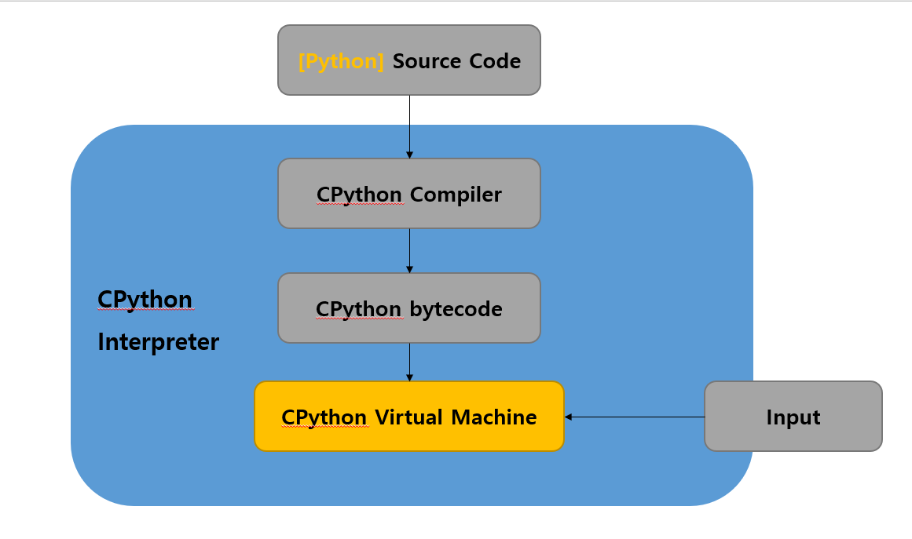

# 01 파이썬 소개

## 1. 파이썬 탄생

### 1.1. 등장 배경과 역사

#### 1) 창시자

**귀도 반 로섬**

귀도 반 로섬(네덜란드어: Guido van Rossum, 1956년 1월 31일 ~)은 네덜란드 출신의 소프트웨어 엔지니어이다. 프로그래밍 언어인 파이썬을 개발한 것으로 유명하다. 2005년부터 2012년까지 구글에서 일했으며, 2013년부터 2019년 10월까지 드롭박스에서 일하고 있었다. 은퇴하였다가 2020년 11월 13일 MS에 다시 입사하였다.


<br>

<br>

#### 2) 프로그래밍 언어명

파이썬이라는 이름은 귀도 반 로섬이 즐겨 보던 코미디 프로그램인 '몬티 파이썬'의 날아다니는 써커스(Monty Python's Flying Circus)에서 따온 것 이다.

'몬티 파이썬'은 영국 코미디 팀으로 각종 코믹 영화와 TV 프로그램을 만들었다. 
( 파이썬의 로고가 뱀 모양인 이유는 python의 원래 뜻이 비단뱀이라서 그렇다. )

---

[참고] 이 영화( [몬티 파이튼의 성배](https://namu.wiki/w/%EB%AA%AC%ED%8B%B0%20%ED%8C%8C%EC%9D%B4%ED%8A%BC%EC%9D%98%20%EC%84%B1%EB%B0%B0) )는 몬티 파이선 팀에서 만든 유명 코믹 영화이다. 

* https://youtu.be/C_j80-85eKM

---

<br>

<br>

#### 3) **개발 과정 및 일화**

1989년 크리스마스 주에, 연구실이 닫혀있어서 심심한 김에 취미로 만든 프로그래밍 언어이다. 
( 하지만 하루 만에 뚝딱 만든 것은 아니고 그 전에 ABC 등 여러 언어 개발을 거친 것으로 보인다. )

최초 버전은 1991년 발표 되었으며 90년대 이 시기에는 다양한 언어( 자바, 자바스크립트, 루비, PHP 등 )들이 탄생했다.

<br>

<br>

<br>

<br>

<br>

### 1.2. 목적

#### 1) 개발 목표  

고등학생 및 비전공자 등이 사용할 수 쉬운 언어를 만드는 것이 목표였다. 

<br>

<br>

#### 2) 철학 및 사상

'<u>가장 아름다운 하나의 답이 존재한다</u>'를 기본으로 한다.
there should be one—and preferably only one—obvious way to do i
( 발산 진화가 아닌 수렴 진화이다. )

예를 들어 팩토리얼 함수는 다음과 같이 간결히 나타낼 수 있다. 

```python
def factorial(x):
    return 1 if x == 0 else x * factorial(x - 1)
```

```python
def factorial: return 1 if x == 0 else x * factorial(x - 1)
```

```python
factorial = lambda x: 1 if x == 0 else x * factorial(x - 1)
```

이 예시는 입문자들을 헷갈리게 하는 3항 연산자(Ternary operator)도 쉽게 읽혀 "실행할 수 있는 의사 코드"라는 별명을 실감하게 한다.

Python스러움(**pythonic**)이라는 '<u>복잡하지 않으면서 의미가 명확하고, 코드의 축약보다 뚜렷하게 보이는 흐름을 중시</u>' 하는 Python의 철학을 지칭하는 독특한 개념도 나오게 된다.

<br>

##### - Python 기본 철학

Python 기본 철학 ( The Zen of Python )

오랜 시간 파이토니어 팀 피터스는 파이썬의 디자인에 대한 BDFL의 지침 원칙을 20개의 격언으로 간결하게 전달했으며, 그 중 19개만 기록되었다.

Long time Pythoneer Tim Peters succinctly channels the BDFL’s guiding principles for Python’s design into 20 aphorisms, only 19 of which have been written down.

> 1. 아름다운 것이 추한 것보다 낫다. (Beautiful is better than ugly.)
> 2. 명시적인 것이 암시적인 것보다 낫다. (Explicit is better than implicit.)
> 3. 간결한 것이 복합적인 것보다 낫다. (Simple is better than complex.)
> 4. 복합적인 것이 복잡한 것보다 낫다. (Complex is better than complicated.)
> 5. 수평적인 것이 내포된 것보다 낫다. (Flat is better than nested.)
> 6. 여유로운 것이 밀집한 것보다 낫다. (Sparse is better than dense.)
> 7. 가독성은 중요하다. (Readability counts.)
> 8. 특별한 경우들은 규칙을 어길 정도로 특별하지 않다. (Special cases aren't special enough to break the rules.)
> 9. 허나 실용성은 순수성을 이긴다. (Although practicality beats purity.)
> 10. 오류는 절대로 조용히 지나가지 않는다. (Errors should never pass silently.)
> 11. 명시적으로 오류를 감추려는 의도가 아니라면. (Unless explicitly silenced.)
> 12. 모호함을 대할 때, 이를 추측하려는 유혹을 거부하라. (In the face of ambiguity, refuse the temptation to guess.)
> 13. 명확한, 그리고 가급적이면 유일한 하나의 방법은 항상 존재한다. (There should be one-- and preferably only one --obvious way to do it.)
> 14. 비록 그 방법이 처음에는 명확해 보이지 않을지라도. (Although that way may not be obvious at first unless you're Dutch.)
> 15. 지금 행동에 옮기는 것이 아예 안 하는 것보다는 낫다. (Now is better than never.)
> 16. 비록 아예 안 하는 것이 지금 *당장* 하는 것보다 나을 때도 많지만. (Although never is often better than *right* now.)
> 17. 구현 결과를 설명하기 쉽지 않다면, 그것은 나쁜 아이디어이다. (If the implementation is hard to explain, it's a bad idea.)
> 18. 구현 결과를 설명하기 쉽다면, 그것은 좋은 아이디어일지도 모른다. (If the implementation is easy to explain, it may be a good idea.)
> 19. 네임스페이스를 사용하는 것은 완전 좋은 생각이다! (Namespaces are one honking great idea -- let's do more of those!)

[출처] [PEP 20](https://www.python.org/dev/peps/pep-0020/)

<br>

> **PEP란?**
>
> *PEP* : Python Enhance Proposal (파이썬 개선 제안서) 
>
> 파이썬 창시자 귀도를 중심으로 수많은 사람들이 기여해서 발전해온 언어입니다.
>
> 귀도라는 최종 결정권자 혹은 그리고 결정을 하는데 가장 큰 영향력을 끼치는 독재자가 존재합니다.
> 하지만 파이썬은 수많은 사람들이 의견을 수용하고, 서로 토론하며 발전해온 언어입니다.
>
> 언어 발전을 위해 논의된 주제를 PEP( Python Enhancement Proposal ) 이라는 이름으로 문서화해왔습니다.
>
> <br>
>
> [ 대표적인 PEP ]
>
> * PEP 20 -- The Zen of Python : 파이썬 철학
> * PEP 8 -- Style Guide for Python Code : 파이썬 스타일

<br>

<br>

#### 3) 개발 기업 및 주체

**[ 개발 기업 및 주체 ] ** [Python 소프트웨어 재단 (PSF)](https://www.python.org/)
파이썬 프로그래밍 언어에 헌신하는 비영리 단체로서, 2001년 3월 6일 런칭했다. 이 단체의 임무는 파이썬 공동체의 개발을 발전시키고, 코어 파이썬 배포판 개발, 지식재산권 관리, 그리고 PyCon을 포함한 개발자 콘퍼런스, 기금 모으기를 포함한 파이썬 공동체 내의 다양한 프로세스를 책임진다.

<br>

<br>

#### 4) 업데이트 방향 

* **[Pytho 버전 2와 3 차이](https://zetawiki.com/wiki/Python_%EB%B2%84%EC%A0%84_2%EC%99%80_3_%EC%B0%A8%EC%9D%B4)**

  - **유니코드 사용**, **소수점 계산**, **까다로운 문법 규칙 적용** 등이 두드러지는 특징이다.

  - 대중적인 사용 지향, 빅데이터를 고려한 소수점 계산, 실수를 방지하기 위한 문법 규칙 적용이라 할 수 있다.

* **현재 업데이트 방향**

  Python의 편의성과 태생적인 속도 문제를 해결하기 위한 업데이트가 진행하고 있다.
  최근에 나온 3.11버전 만 하더라도 상당한 속도 향상을 진행할 것ㅇ르 볼 수 있다. 

---

* 1991년 : 최초 버전 발표
* 2000년 : Python 2
* 2008년 : Python 3
  * 2023년 : 3.11 ( 2023년 4월 5일 출시 )


---

<br>

<br>

<br>

<br>

<br>

## 2. 특징 및 비교

### 2.1. 공통 특징 - 5가지

1. ~~Low Level~~ / **High Level**
2. ~~Compiler~~ / ~~Jit~~ / **interpreter**
3. ~~Strong~~ / **Weak**
4. **Managed** / ~~UnManaged~~
5. ~~Procedural~~ / **OOP** / ~~functional~~


**[ 1. High Level ]**

고수준 언어로 여기서 저수준과 고수준 언어의 차이는 얼마나 인간 친화적인 언어에 가까운가에 있다.

파이썬은 영어와 유사한 구문 방식을 가지고 있으며 사용하기 쉬운 고수준 언어로 평가된다.

특히, 다른 언어에 비해 문법적인 면에서 관대한 편이다.


**[ 2. 인터프리터 언어 ]**
빠르게 한 줄 단위로 바로바로 번역과 실행이 되기 때문에 소스코드를 직접 실행하는 것 처럼 보인다. 
실시간 real-time이다.

파이썬 컴파일러는 명령어를 바이트코드(ByteCode) 명령문으로 번역하고 이를 하드 디스크의 .pyc 파일에 저장한다. 그리고 파이썬 인터프리터는 .pyc 파일을 번역하여 인터프리터 방식으로 기계어로 번역한다. 이러한 인터프리터를 파이썬 가상머신(Python Virtusl Machine)이라고 한다.

<br>

**Python - 인터프리터**

Python 인터프리터 안에서는 이런 작업이 이루어 진다.

1. **바이트 코드 - 컴파일**
   가상머신에서 작동할 수 있는 바이트 코드로 컴파일 한다.
2. **프로그램 실행 - 가상머신**
   만들어 진 바이트 코드를 가지고, 파이썬 가상머신에서 프로그램이 실행되는 것이다.



> **CPython - 파이썬 표준 구현체**
>
> Python 공식 홈페이지에서 설치하는 일반적인 Python이 이 CPython이다.
>
> C로 구현된 Python 인터프리터 구현체이다.
> 파이썬 코드를 **가상머신**에 의해 해석되는 '**바이트코드**'로 컴파일을 한다. 
>
> C로 주로 구현 되었기 때문에 CPython이라고 부른다.
> ( C로만 작성된 것은 아니며 주로 C와 Python으로 작성된 구현체이다. )
>
> CPython은 파이썬 개발자에게 블랙박스와 같다.
> 파이썬으로 프로그래밍 하면서 꼭 CPython을 알아야 하는 것은 아니지만, 
> 파이썬을 깊이 있게 이해하고 코드를 변용할 때 효율적이고 올바른 방법을 알기 위해서는 Cpython에 대해 알아야 한다. 
>
> - 파이썬 개발을 중급 이상으로 하고 싶다면 CPython도 공부하자.
> - [공식 GitHub 리포지터리](https://github.com/python/cpython)


> **파이썬 구현체 - Python Implementations**
>
> Python은 Python 소프트웨어 재단에서 만들고 관리하는 언어로서 이를 각 운영체제에서 돌리기 위한 표준 런타임도 같은 단체에서 제작한다. 
> 그러나 성능, 확장성 등 다양한 이유로 같은 Python 코드를 다른 방식으로 돌리기 위한 비표준 구현체들도 다양하게 개발되어 있다.
>
> 비표준 구현체들은 반복 계산, 특수한 환경에서는 유용할지 모르나 일반적인 용도로 사용하기에는 제약이 많다. 
> 스스로 모든 코딩을 한다면 모르지만 다양한 패키지들을 불러들어 사용할 때에는 예상치 못한 오류를 잔뜩 마주하게 되기 때문이다. 
>
> Python 패키지들은 CPython이라는 표준 구현체를 기준으로 제작되어 다른 구현체에서는 구조적으로 실행 자체가 불가능한 경우도 있다.


---


**프로그래밍 실행 과정** 

설치 => 소스 코드 =>  인터프리터  =>  실행 ( 메모리 로드  / CPU 연산 )

> * 수행 성능이 좋지 못하다. - 컴파일러 언어에 비해서 느리다.
> * 바뀐 내용이 즉시 반영할 수 있기 때문에 **유연성**이 뛰어나다.
> * 소스코드 배포 방식이라 실행 환경(리눅스, 윈도우, 맥 등)에 구애 받지 않는다.
>   * 호환성이 좋은 편이다.


---


**[ 3. Weak Typed ( Dynamically typed ) ]**

동적 타입 언어의 자료형은 컴파일 시 자료형을 정하는 것이 아니고 실행 시(런타임)에 결정합니다. 

* 타입 자체를 엄격하게 구분하지 않는다. 

```python
num1 = 10;
name = "Evan Hwang"
```

>**장점**
>
>런타임까지 타입에 대한 결정을 끌고 갈 수 있기 때문에 유연성이 높다.
>컴파일시 타입을 명시해주지 않아도 되기 때문에 빠르게 코드를 작성할 수 있다.

> **단점**
>
> 실행 도중에 변수에 예상치 못한 타입이 들어와 타입 에러가 발생할 수 있다.
> 동적타입 언어는 런타임 시 확인할 수 밖에 없기 때문에, 코드가 길고 복잡해 질 경우 타입 에러를 찾기가 어려워진다.

 <br>


**[ 4. Managed Language ]** 
메모리 관리(할당, 반환)를 언어 상에서 알아서 해주기 때문에 편하게 코드를 작성할 수 있다.

컴퓨터의 깊은 구조를 모르고도 개발을 쉽게 할 수 있는 언어이다.

( 반대로 메모리 관리를 직접 해야 하는 Unmanaged Language : C, C++ 언어들이 있다. )

<br>


**[ 5. OOP ]**

객체 지향 프로그래밍은 컴퓨터 프로그램을 명령어의 목록으로 보는 시각에서 벗어나 여러 개의 독립된 단위, 즉 "객체"들의 모임으로 파악하고자 하는 것이다. 각각의 객체는 메시지를 주고받고, 데이터를 처리할 수 있다.

객체 지향 프로그래밍은 프로그램을 유연하고 변경이 쉽게 만들기 때문에 대규모 소프트웨어 개발에 많이 사용된다. 또한 프로그래밍을 더 배우기 쉽게 하고 소프트웨어 개발과 보수를 간편하게 하며, 보다 직관적인 코드 분석을 가능하게 하는 장점이 있다. 그러나 지나친 프로그램의 객체화 경향은 실제 세계의 모습을 그대로 반영하지 못한다는 비판을 받기도 한다.


### 2.3. 차별점

#### 1) 뚜렷한 권장 코드 스타일

간결한 문법을 대신하여 뚜렷한 권장 코드 스타일을 가지고 있다.

특유의 철학 때문에 코드 스타일이 엄격한 편이다. 잘 작동하는지와는 별개로 가독성을 위해 이렇게 쓰기를 권장한다는 스타일 가이드까지 있다. Python 공식 문서에서는 Python에 맞는 코딩 스타일을 지키기를 권장하는데, 이것이 바로 [PEP 8](https://www.python.org/dev/peps/pep-0008/)이다.

* **블럭 처리 규칭**
  PEP 8에 명시된 공식 코딩 가이드에서는 소스 코드 들여쓰기에 탭(Tab) 문자 대신 **공백(Space) 4문자**를 넣기를 매우 강력히 권장한다.

  ```python
  def factorial(x):
      if x == 0:
          return 1
      else:
          return x * factorial(x - 1)
  ```

* **작명 규칙**

  Python에서는 변수나 클래스 이름을 어떻게 짓든 잘 작동한다. 그렇지만 PEP 8 에서는 이에 대한 권장 스타일도 명시하고 있다.
  예외적인 경우가 아니라면 Python을 코딩할 때에는 가독성을 위해 이 권장 스타일을 따르는 것이 좋다.

  아래는 **이름에 대한 대표적인 스타일 가이드**이다.

  - 일반적으로 스네이크 표기를 쓰되, 특정한 종류에는 파스칼 표기를 쓴다. 
  - 변수는 소문자로 시작하며, 내부변수(internal)는 맨 앞에 밑줄(underbar, _) 1개로 시작하며, 숨은변수(hidden)은 밑줄 2개로 시작한다.
    - attribute_name = 0
    - _protected_attribute_name = 0
    - __hidden_attribute_name = 0

  | 종류                             | 규칙            | 예시                     |
  | -------------------------------- | --------------- | ------------------------ |
  | 패키지(package)                  | 스네이크()      |                          |
  | 모듈(module)                     | 스네이크()      | import module_name       |
  | 클래스(class)                    | 파스칼()        | class ClassName()        |
  | 예외(exception)                  | 파스칼          |                          |
  | 함수(function)                   | 스네이크()      | def function_name()      |
  | 상수(constant)                   | **대문자**+밑줄 | MODULE_CONSTANT_NAME = 0 |
  | 변수(variable)                   | 스네이크        | variable_name = 0        |
  | 매개변수(parameter)              |                 |                          |
  | 지역변수                         |                 |                          |
  | 인스턴스 변수(instance variable) |                 |                          |
  | 메서드(method)                   | 스네이크()      | method_name()            |

* **문법 규칙**

  * 한 줄은 79글자로 제한하기

  - import는 파일의 맨 위에 적고 내장 모듈, 제3자 모듈, 직접 만든 모듈 순서로 불러들이기
  - 인스턴스 메서드의 첫 인자는 self로 쓰고, 클래스 메서드의 첫 인자는 cls로 쓰기
  - 할당 연산자(=)의 앞뒤로 공백 넣기


**※ 더 자세한 내용은 공식 문서를 참조하자. -  [PEP 8](https://www.python.org/dev/peps/pep-0008/)**


> **[ 코드 스타일 관리 패키지 ]**
>
> 코드 스타일을 자동으로 권장 사항에 맞추어 수정해 주는 Python 패키지도 있는데, [Black](https://github.com/psf/black) 이 대표적이다. 
> PyCharm이나 Visual Studio Code 등의 IDE는 이들 도구를 확장 기능으로 제공하여 에디터 GUI 화면 상에서 편리하게 사용할 수 있다.
>
> ( Python 소프트웨어 재단이 직접 만들고 관리하는 패키지다 )


#### 2) 순수 객체 지향

Python에는 원시 타입(Primitive Type)이 존재하지 않으며, **모든 것이 객체로 취급된다.** 
나아가 클래스, 함수 역시 객체로 취급할 수 있다. 상수 역시 상수가 저장된 객체라고 본다. 다음과 같은 상수 할당문이 있을 때,

```python
x = 10
```

이는 변수 x 자체에 10이 할당된 것이 아니라 x가 10이 저장된 상수 객체를 가리키는 것을 의미한다. 
내부적으로는 C의 포인터 연산과 같은 동작이 행해지는 것이다. 이렇게 x에 대입되는 값을 변경할 경우,

```python
x = 10
x = 20
```

x가 가리키는 대상이 10이 저장된 상수 객체에서 20이 저장된 상수 객체로 바뀐 것이다. x 자체의 값이 10에서 20으로 바뀐 게 아니다.

( [참고] https://namu.wiki/w/Python#s-3.3 - 더 공부한 이후 링크 내용을 참고해서 개념을 보충하자. )


또한 OOP적 측면에서도 완성도가 높다.

- 추상화가 잘 되어있다.


#### 3) 반복 가능한 객체

Python의 가장 큰 특징 중 하나. Python은 반복 가능한 객체(iterable)라는 강력한 기능을 제공한다. 이 객체는 집합, 문자열, 리스트, 튜플, 딕셔너리, 그리고 함수까지도 반복이 가능하며, 이것을 for 구문에서 사용할 수 있게 해준다. 리스트와 튜플 등은 좀 편해지는 정도라 할 수 있지만, 함수의 값을 반복할 수 있다는 것은 큰 장점이다. 그 예로 n의 배수를 구하는 f(n) 함수가 있을 때,

```python
def f(n):
    x = 1
    while True:
        yield n*x
        x += 1
        print("x : ", x);

ot = f(2)
print(ot)
print("next : ", next(ot))
print("next : ", next(ot))
```

```
<generator object f at 0x7f190ef1e900>
next :  2
x :  2
next :  4
```

와 같은 함수를 만드는 것도 가능하다. 함수를 호출하고 나서도 함수가 완전히 끝나기 전까지는 지역 변수가 남아있으며, 함수가 끝나야 지역 변수가 삭제된다. 따라서 함수를 호출할 때마다 x의 값이 증가한다. 이렇게 만들어진 반복 가능한 객체는 __next__ 함수나 next(객체) 함수, 또는 for ... in 객체와 같은 문법들을 이용하여 순서대로 값을 호출할 수 있다. 특히 제너레이터의 경우, 미리 만들어놓는 게 아니라, 호출 될 때 반환값을 새로 만들어 반환하는 방식이기 때문에 메모리 관리 면에서도 이점이 있다.


#### 4) 다양한 패키지

다양한 패키지가 존재하며 쉽게  설치해서 사용할 수 있다. 


#### 5) C/C++와의 결합 활용

파이썬과 C는 찰떡궁합이란 말이 있다. 
프로그램의 전반적인 뼈대는 파이썬으로 만들고, 빠른 실행 속도가 필요한 부분은 C로 만들어서 파이썬 프로그램 안에 포함시키는 것이다. ( 참 영악한 언어다. )
사실 파이썬 라이브러리 중에는 순수 파이썬만으로 제작된 것도 많지만 C로 만든 것도 많다. 

당연하게도 C로 만든 것은 대부분 속도가 빠르다.

또한 속도가 필요하면 C언어의 구현 기능을 활용할 수 있다. 

파이썬은 접착(glue) 언어라고도 부르는데, 그 이유는 다른 언어와 잘 어울려 결합해서 사용할 수 있기 때문이다. 
C나 C++로 만든 프로그램을 파이썬에서 사용할 수 있으며, 파이썬으로 만든 프로그램 역시 C나 C++에서 사용할 수 있다. ( 여러가지 라이브러리를 사용할 수 있다. )


### 2.4. 장단점 

( + 타언어와 비교 )


#### 1) **장점**

생산성 높고, 쉽게 개발 할 수 있다.
( 보조 도구로도 많이 사용된다. )

* **문법이 간결하다.** 

  * 영어 기준 - 인간다운 언어이다.
  * 쉽다. ( 고등학생과 비전공자도 쉽게 배울 수 있는 언어다. )

  컴파일 언어는 빠르지만 대체로 여러 규악들 때문에 코드가 길어지고, 
  인터프리트 언어는 컴파일 언어보다 느리지만 **여러 규약들에 자유로워 개발속도가 빠르다.** 

* **방대한 오픈소스**

  라이브러리, 패키지

* **커뮤니티 발달 / 피드백 용이성**

  Python 특유의 철학(코딩스타일)을 지키다 보니, 문법 자체가 딱 떨어지게 표현된다. 
  이 때문에 다른 사람이 제안하고 만든 프로그램을 수많은 사람들이 보고 쉽게 접근할 수 있다. 

  Perl 같은 경우는 **Write Once, Read Never**라고 불릴 정도로 피드백과는 담을 쌓았는데, Python은 문법이 통일되어 있다 보니 **Write Once, Read Infinitely**가 되었다. 그래서 프로그램 하나 만들면 다른 프로그래머들에 의해 엄청난 양의 피드백이 들어오게 되었고, 이는 곧 생산성 향상으로도 이어졌다.

  * 다수의 사용자 + 오래 된 개발 역사

* **다양한 응용 분야**

  [참고] [Programming languages used in most popular websites](https://en.wikipedia.org/wiki/Programming_languages_used_in_most_popular_websites)

  * GUI
  * 웹 프로그래밍
  * 데이터베이스 연동
  * 과학 및 공학 분야
    * 데이터 분석
    * 머신러닝, 딥러닝
    * 컴퓨터 비전
  * 시스템 유틸리티 제작


#### 2) **단점**

컴퓨터 자원(CPU, 메모리 등)을 효율적으로 활용할 수 없기 때문에 한계가 있다.
( 이런 단점들은 우회를 하거나 새로운 방안을 마련하려고 한다. )

1. **느린 실행 속도**

   컴파일 언어는 빠르지만 대체로 여러 규악들 때문에 코드가 길어지고, 
   인터프리트 언어는 컴파일 언어보다 느리지만 여러 규약들에 자유롭고 개발속도가 빠르다. 

2. **메모리 낭비**

3. **비효율적 멀티코어 활용**

4. **불편한 사용자 배포**

   긴 역사에도 불구하고 일반 사용자에게 배포를 하는 과정이 덜 발달되어있고 복잡하다. 단순히 복잡하기만 하면 문제가 없는데, 원시적이고 간접적인데다 파편화 되어있으니 문제가 크다.

   Python은 기본적으로 'Python을 설치하고 개발 환경을 구성한 사람이' '자기 컴퓨터나 자기가 관리하는 시스템 속에서 돌릴 프로그램을' '직접 만들어 쓰는' 것을 최대의 목적으로 발달해 왔기 때문에 **'프로그램을 만드는 환경**' 과 **'프로그램을 돌리는 환경**'이 사실상 구분되어 있지 않다. 

   ( 자체 프로토타입 제작 용도로 사용되기 적합하다. )

5. **취약한 리버스엔지니어링**

   패키지가 일반 사용자에게 배포되더라도 Python 코드는 리버스엔지니어링에 취약해 코드가 매우 쉽게 공개된다. 
   암호화를 하더라도 키 난수화를 무한반복하면 결국 코드는 뚫린다. 

6. **제품화가 어려운 분야**
   보통 자원효율을 중요시 여기는 분야다.

     * 모바일 프로그래밍
     * 실시간 3D 그래픽스와 게임
     * 시스템과 밀접한 프로그래밍 영역


### 2.5. 실무 : 주 사용처 

  - 오픈소스 프로젝트, 기업 등


#### 1) 사용 중인 분야 ( O )

[ 참고 ] [Programming languages used in most popular websites](https://en.wikipedia.org/wiki/Programming_languages_used_in_most_popular_websites)

[ 대표 개발 기업 ] 인스타, 레딧, 핀터레스트

* **시스템 유틸리티 제작**
  파이썬은 운영체제(윈도우, 리눅스 등)의 시스템 명령어를 사용할 수 있는 각종 도구를 갖추고 있기 때문에 이를 바탕으로 갖가지 시스템 유틸리티를 만드는 데 유리하다. 
* **GUI** 
  [PyQt5](https://pypi.python.org/pypi/PyQt5), Tkinter, [PySide](https://doc.qt.io/qtforpython/)


* **웹 프로그래밍**

  - [Django](https://namu.wiki/w/Django) : 풀 스택 웹프레임.정식으로 비동기 프로그래밍이 가능한 것은 아니지만 ASGI 서버와도 부분적으로 호환이 된다.
  - [Flask](https://namu.wiki/w/Flask) : 마이크로 웹 프레임워크. 가볍고 간단한 서비스를 만들기 좋으나, 복잡한 기능은 모두 플러그인을 설치해야 한다.

* **크롤링  -  [셀레니움(Selenium)](https://www.selenium.dev/)**

* **데이터베이스 연동**

  파이썬은 사이베이스(Sybase), 인포믹스(Infomix), 오라클(Oracle), 마이에스큐엘(MySQL), 포스트그레스큐엘(PostgreSQL) 등의 데이터베이스에 접근하기 위한 도구를 제공한다.

  또한 이런 굵직한 데이터베이스를 직접 사용하는 것 외에도 파이썬에는 재미있는 도구가 하나 더 있다. 바로 피클(pickle)이라는 모듈이다. 피클은 파이썬에서 사용하는 자료를 변형 없이 그대로 파일에 저장하고 불러오는 일을 맡아 한다. 이 책에서는 외장 함수에서 피클을 어떻게 사용하고 활용하는지에 대해서 알아본다.

  * [sqlite](https://docs.python.org/ko/3/library/sqlite3.html) : [SQLite](https://namu.wiki/w/SQLite) 데이터베이스에 접근하기 위한 라이브러리
  * [pymongo](https://github.com/mongodb/mongo-python-driver) : [MongoDB](https://namu.wiki/w/MongoDB)에 접근하기 위한 라이브러리


* **과학 및 공학 분야**

  과학과 공학 분야에서 필요한 여러 기능을 기본적으로 제공한다. 

  우선 언어 자체적으로 64비트를 넘어가는 매우 큰 정수를 지원한다. 
  또한 허수를 기본적으로 지원하며, 표준 라이브러리의 decimal, fractions 모듈을 사용해 소수점과 유리수를 정밀하게 다룰 수 있다. 
  따라서 이러한 기능을 다루는 암호학과 통계 분야에서 쓰기에 알맞다.

  * **수치 연산  -  [넘파이](https://namu.wiki/w/NumPy)(NumPy)**
    넘파이(NumPy)라는 수치 연산 모듈을 제공한다. 
    이 모듈은 C로 작성했기 때문에 파이썬에서도 수치 연산을 빠르게 할 수 있다.

  * **데이터 분석  -  [팬더스(pandas)](https://namu.wiki/w/Pandas)**

    파이썬으로 만든 판다스(Pandas) 모듈을 사용하면 데이터 분석을 더 쉽고 효과적으로 할 수 있다. 

  * **머신러닝, 딥러닝  -  [TensorFlow](https://namu.wiki/w/TensorFlow), [파이토치](https://namu.wiki/w/파이토치)**

    파이썬은 머신러닝 프로그램을 작성하기에 가장 적합한 도구이며 머신러닝 프로그램 작성을 도와주는 사이킷런(scikit-learn), 텐서플로(Tensorflow), 파이토치(PyTorch), 케라스(Keras) 등의 수 많은 라이브러리들을 사용할 수 있다.

    [참고] 인공지능은 파이썬에서 훈련시키고 제품화는 속도가 빠른 다른 언어로 하는 경우가 많다.

  * **컴퓨터 비전**

  

* **해킹 툴**  -  https://youtu.be/YkF0CjsYeA0
  ( 생산성 실용성 / 보안 툴 존재 - 공격률 툴 77% 파이썬 기반 )


#### 2) 사용하기 어려운 분야 ( X )

보통 자원효율을 중요시 여기는 분야다.

  * **모바일 프로그래밍**

    파이썬은 구글이 가장 많이 애용하는 언어이지만 파이썬으로 안드로이드 앱(Native App)을 개발하는 것은 아직 어렵다. 안드로이드에서 파이썬으로 만든 프로그램이 실행되도록 지원하긴 하지만 이것만으로 앱을 만들기에는 아직 역부족이다. 아이폰 앱을 개발하는 것 역시 파이썬으로 할 수 없다.

  * **실시간 3D 그래픽스와 게임**

  * **시스템과 밀접한 프로그래밍 영역**

    파이썬으로 리눅스와 같은 운영체제 또는 엄청난 횟수의 반복과 연산이 필요한 프로그램을 만드는 것은 어렵다. 
    빠른 속도를 요구하거나 하드웨어를 직접 건드려야 하는 프로그램에는 적합하지 않다.

    * 윈도우, 리눅스


